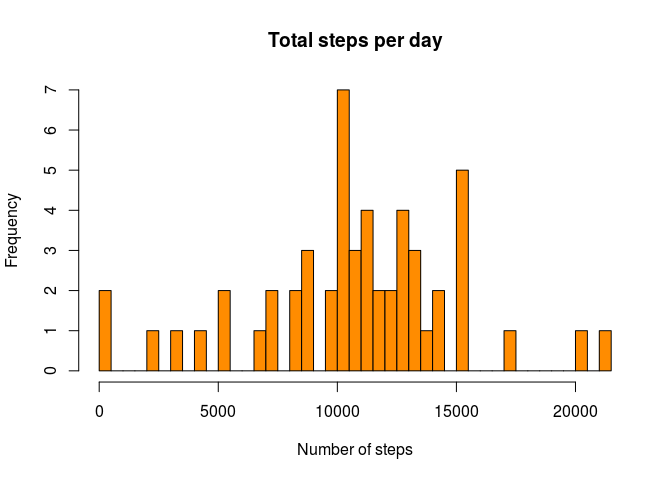
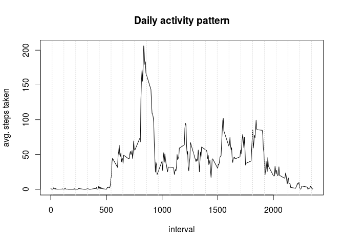

# Reproducible Research: Peer Assessment 1
Kenneth Dombrowski  

Text in italics is copied from the [assignment][1].

To begin, let's set some global options.  We want R code to always echo, nothing 
to be cached, and for Rmarkdown to be verbose:


```r
library(knitr)
opts_knit$set(echo = TRUE, cache = FALSE, verbose = TRUE)
```

## Loading and preprocessing the data

Your working directory must be set to the top level of this repo, 
e.g. `setwd("~/git/RepData_PeerAssessment1")`.


```r
unzip("activity.zip")
activity = read.csv("activity.csv")
```

Let's take a peek at the data:


```r
str(activity)
```

```
## 'data.frame':	17568 obs. of  3 variables:
##  $ steps   : int  NA NA NA NA NA NA NA NA NA NA ...
##  $ date    : Factor w/ 61 levels "2012-10-01","2012-10-02",..: 1 1 1 1 1 1 1 1 1 1 ...
##  $ interval: int  0 5 10 15 20 25 30 35 40 45 ...
```

```r
summary(activity)
```

```
##      steps                date          interval     
##  Min.   :  0.00   2012-10-01:  288   Min.   :   0.0  
##  1st Qu.:  0.00   2012-10-02:  288   1st Qu.: 588.8  
##  Median :  0.00   2012-10-03:  288   Median :1177.5  
##  Mean   : 37.38   2012-10-04:  288   Mean   :1177.5  
##  3rd Qu.: 12.00   2012-10-05:  288   3rd Qu.:1766.2  
##  Max.   :806.00   2012-10-06:  288   Max.   :2355.0  
##  NA's   :2304     (Other)   :15840
```

Note the 2,304 `NA` values out of 17,568 observations (about 13%).


## What is mean total number of steps taken per day?

*For this part of the assignment, you can ignore the missing values in the dataset.*

First, we create an aggregate of the sum of all steps taken each day:


```r
steps_per_day <- aggregate(steps ~ date, activity, sum)
```

Again, let's take a peek at the data to make sure it looks like what we expect:


```r
str(steps_per_day)
```

```
## 'data.frame':	53 obs. of  2 variables:
##  $ date : Factor w/ 61 levels "2012-10-01","2012-10-02",..: 2 3 4 5 6 7 9 10 11 12 ...
##  $ steps: int  126 11352 12116 13294 15420 11015 12811 9900 10304 17382 ...
```

```r
head(steps_per_day)
```

```
##         date steps
## 1 2012-10-02   126
## 2 2012-10-03 11352
## 3 2012-10-04 12116
## 4 2012-10-05 13294
## 5 2012-10-06 15420
## 6 2012-10-07 11015
```

```r
summary(steps_per_day)
```

```
##          date        steps      
##  2012-10-02: 1   Min.   :   41  
##  2012-10-03: 1   1st Qu.: 8841  
##  2012-10-04: 1   Median :10765  
##  2012-10-05: 1   Mean   :10766  
##  2012-10-06: 1   3rd Qu.:13294  
##  2012-10-07: 1   Max.   :21194  
##  (Other)   :47
```

Notice we have only 53 observations, but the `date` factor has the expected 61 
levels (31 days in October + 30 days in November).  This suggests there are 8 
dates for which we have only `NA` values.

To test this theory, let's subset only the `NA` rows of the activity data and 
turn it into a boolean:


```r
na_steps <- subset(activity, is.na(activity$steps), c("date", "steps"))
na_steps$steps <- TRUE
aggregate(steps ~ date, na_steps, sum)
```

```
##         date steps
## 1 2012-10-01   288
## 2 2012-10-08   288
## 3 2012-11-01   288
## 4 2012-11-04   288
## 5 2012-11-09   288
## 6 2012-11-10   288
## 7 2012-11-14   288
## 8 2012-11-30   288
```

There are only 8 days with `NA` steps values, and all 8 are missing all 288 
observations for the day (there are 1,440 minutes in a day, divided by 5 = 288).


### Histogram of total steps per day

*Make a histogram of the total number of steps taken each day*

The histogram displays the frequency that occurances of the total steps taken per
day falls within a set of ranges.

Adding a `breaks` argument to increase the granularity of the graph reveals some
interesting sparse ranges toward the extremes of the x-axis:


```r
hist(steps_per_day$steps, main = "Total steps per day", xlab = "Number of steps", 
     breaks = 36, col = "darkorange")
```

 


### Mean & median of total steps per day

*Calculate and report the mean and median of the total number of steps taken per day*


```r
mean_steps_per_day <- mean(steps_per_day$steps)
median_steps_per_day <- median(steps_per_day$steps)
```

The mean steps per day is **1.0766189\times 10^{4}**, and the median is **10765**.


## What is the average daily activity pattern?

This time our aggregate is the average steps taken during each interval, 
across all days in the dataset.


```r
avg_steps_per_interval <- aggregate(steps ~ interval, activity, mean)
head(avg_steps_per_interval)
```

```
##   interval     steps
## 1        0 1.7169811
## 2        5 0.3396226
## 3       10 0.1320755
## 4       15 0.1509434
## 5       20 0.0754717
## 6       25 2.0943396
```

```r
summary(avg_steps_per_interval)
```

```
##     interval          steps        
##  Min.   :   0.0   Min.   :  0.000  
##  1st Qu.: 588.8   1st Qu.:  2.486  
##  Median :1177.5   Median : 34.113  
##  Mean   :1177.5   Mean   : 37.383  
##  3rd Qu.:1766.2   3rd Qu.: 52.835  
##  Max.   :2355.0   Max.   :206.170
```


### Time-series plot of daily activity pattern

*Make a time series plot (i.e. type = "l") of the 5-minute interval (x-axis) and the average number of steps taken, averaged across all days (y-axis)*


```r
plot(avg_steps_per_interval$interval, avg_steps_per_interval$steps, type = "l",
     main = "Daily activity pattern", xlab = "interval", ylab = "avg. steps taken")
# add grid depicting 24 hours
grid(nx = 24, ny = 1)
```

 


### Interval with most steps on average

*Which 5-minute interval, on average across all the days in the dataset, contains the maximum number of steps?*


```r
# convert from list to data.frame
avg_steps_per_interval_df = as.data.frame(avg_steps_per_interval)
# sort by avg steps
avg_steps_per_interval_df[ order(avg_steps_per_interval_df[2], decreasing = TRUE),  ][1, ]
```

```
##     interval    steps
## 104      835 206.1698
```

```r
interval_with_highest_avg_steps <- avg_steps_per_interval_df[ order(avg_steps_per_interval_df[2], decreasing = TRUE),  ][1, 1]
```

The interval with the most steps on average is **835**.


## Imputing missing values

*Note that there are a number of days/intervals where there are missing values (coded as NA). The presence of missing days may introduce bias into some calculations or summaries of the data.*


## Are there differences in activity patterns between weekdays and weekends?


[1]: https://class.coursera.org/repdata-032/human_grading/view/courses/975145/assessments/3/submissions
[2]: http://stackoverflow.com/questions/26001534/maintain-nas-after-aggregation-r?rq=1
