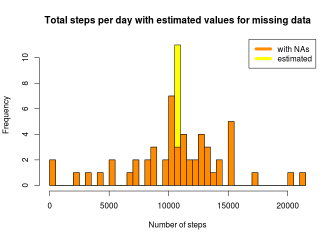

# Reproducible Research: Peer Assessment 1
Kenneth Dombrowski  
`r Sys.Date()`  

Text in italics is copied from the [assignment][1] for reference.

These global options will cause R code to always echo by default, nothing to be 
cached, and for Rmarkdown to be verbose:


```r
library(knitr)
opts_knit$set(echo = TRUE, cache = FALSE, verbose = TRUE)
set.seed(1)
```

## Loading and preprocessing the data

To load the data your working directory must be set to the top level of this 
repo, e.g. `setwd("~/git/RepData_PeerAssessment1")`.


```r
unzip("activity.zip")
activity = read.csv("activity.csv")
```

The data consists of one observation taken every five minutes for a period of 
two months, or 61 days (October 1...31 + November 1...30).  61 * 1440 (minutes 
in a day) = 87,840, divided by 5 we expect 17,568 observations.

1440 / 5 works out to 288 observations per day.


```r
str(activity)
```

```
## 'data.frame':	17568 obs. of  3 variables:
##  $ steps   : int  NA NA NA NA NA NA NA NA NA NA ...
##  $ date    : Factor w/ 61 levels "2012-10-01","2012-10-02",..: 1 1 1 1 1 1 1 1 1 1 ...
##  $ interval: int  0 5 10 15 20 25 30 35 40 45 ...
```

```r
summary(activity)
```

```
##      steps                date          interval     
##  Min.   :  0.00   2012-10-01:  288   Min.   :   0.0  
##  1st Qu.:  0.00   2012-10-02:  288   1st Qu.: 588.8  
##  Median :  0.00   2012-10-03:  288   Median :1177.5  
##  Mean   : 37.38   2012-10-04:  288   Mean   :1177.5  
##  3rd Qu.: 12.00   2012-10-05:  288   3rd Qu.:1766.2  
##  Max.   :806.00   2012-10-06:  288   Max.   :2355.0  
##  NA's   :2304     (Other)   :15840
```

The `str()` output shows us the expected number of observations, and the summary of
the `date` variable indicates we have the expected 288 observations per day.

Notice the 2,304 `NA` values out of 17,568 observations (about 13%).


###  Non-contiguous intervals

The summary of the `interval` variable is interesting in that the max value is 
greater than the total number of minutes in a day.  From the `str()` output one 
might expect the values to be a series from 0 to 1435 (288 increments of 5), so
you could do math like `as.POSIXct(activity[288, 2]) + (60 * activity[288, 3])`
and get the result `"2012-10-01 23:55:00 EDT"`.

Instead, the `interval` value uses the 10s place to indicate the hour; for midnight 
to one a.m., the range 0..55 is used, one a.m. to two a.m. uses 100..155, eleven p.m.
to midnight uses 2300..2355.

Rather than trying to parse that, we will simply create a new variable to represent
the minute of the day by assigning a vector of 288 increments of 5, beginning with 0, 
which will repeat for each day's 288 observations:


```r
activity$daymin <- c(0:287) * 5
tail(activity)
```

```
##       steps       date interval daymin
## 17563    NA 2012-11-30     2330   1410
## 17564    NA 2012-11-30     2335   1415
## 17565    NA 2012-11-30     2340   1420
## 17566    NA 2012-11-30     2345   1425
## 17567    NA 2012-11-30     2350   1430
## 17568    NA 2012-11-30     2355   1435
```

### Add datetime variable

With `daymin` in place, we can use it in combination with the `date` string 
to add a datetime variable, called `dt`:


```r
activity$dt <- as.POSIXct(activity[, 2]) + (60 * activity[, 4])
tail(activity)
```

```
##       steps       date interval daymin                  dt
## 17563    NA 2012-11-30     2330   1410 2012-11-30 23:30:00
## 17564    NA 2012-11-30     2335   1415 2012-11-30 23:35:00
## 17565    NA 2012-11-30     2340   1420 2012-11-30 23:40:00
## 17566    NA 2012-11-30     2345   1425 2012-11-30 23:45:00
## 17567    NA 2012-11-30     2350   1430 2012-11-30 23:50:00
## 17568    NA 2012-11-30     2355   1435 2012-11-30 23:55:00
```

### Add is_weekend boolean

One distinction we will want to make in our analysis is separating weekday 
activity from weekend activity.  We can use the `weekdays()` function together 
with the `dt` variable we just created to distinguish between them.

While we're at it, we might as well keep a `weekday` variable around too -- if 
nothing else, it makes it easier to debug calculations based on the `is_weekend`
variable.


```r
activity$weekday <- weekdays(activity$dt)
activity$is_weekend <- activity$weekday %in% c("Saturday", "Sunday")
```

October 2012 had 4 Saturdays + 4 Sundays (6-7, 13-14, 20-21, 27-28), as did 
November (3-4, 10-11, 17-18, 24-25), for a total of 16 days, or 4608 observations.


```r
count_weekend_days <- nrow(subset(activity, activity$is_weekend))
```

We flagged **4608** as weekend days.

Our final `activity` data looks like this:


```
##   steps       date interval daymin                  dt weekday is_weekend
## 1    NA 2012-10-01        0      0 2012-10-01 00:00:00  Monday      FALSE
## 2    NA 2012-10-01        5      5 2012-10-01 00:05:00  Monday      FALSE
## 3    NA 2012-10-01       10     10 2012-10-01 00:10:00  Monday      FALSE
## 4    NA 2012-10-01       15     15 2012-10-01 00:15:00  Monday      FALSE
## 5    NA 2012-10-01       20     20 2012-10-01 00:20:00  Monday      FALSE
## 6    NA 2012-10-01       25     25 2012-10-01 00:25:00  Monday      FALSE
```


## What is mean total number of steps taken per day?

*For this part of the assignment, you can ignore the missing values in the dataset.*

First, we create an aggregate of the sum of all steps taken each day:


```r
steps_per_day <- aggregate(steps ~ date, activity, sum)
```

Again, let's take a peek at the data to make sure it looks like what we expect:


```r
str(steps_per_day)
```

```
## 'data.frame':	53 obs. of  2 variables:
##  $ date : Factor w/ 61 levels "2012-10-01","2012-10-02",..: 2 3 4 5 6 7 9 10 11 12 ...
##  $ steps: int  126 11352 12116 13294 15420 11015 12811 9900 10304 17382 ...
```

Notice we have only 53 observations, but the `date` factor has the expected 61 
levels (31 days in October + 30 days in November).  This suggests there are 8 
dates for which we have only `NA` values.

To test this theory, let's subset only the `NA` rows of the activity data and 
turn it into a boolean:


```r
na_steps <- subset(activity, is.na(activity$steps), c("date", "steps"))
na_steps$steps <- TRUE
aggregate(steps ~ date, na_steps, sum)
```

```
##         date steps
## 1 2012-10-01   288
## 2 2012-10-08   288
## 3 2012-11-01   288
## 4 2012-11-04   288
## 5 2012-11-09   288
## 6 2012-11-10   288
## 7 2012-11-14   288
## 8 2012-11-30   288
```

There are 8 days with `NA` steps values, and all 8 are missing all 288 
observations for the day.


### Histogram of total steps per day

*Make a histogram of the total number of steps taken each day*

The histogram displays the frequency that occurances of the total steps taken per
day falls within a set of ranges.

Adding a `breaks` argument to increase the granularity of the graph reveals some
interesting sparse ranges, especially toward the extremes of the x-axis:


```r
hist(steps_per_day$steps, main = "Total steps per day", xlab = "Number of steps", 
     breaks = 36, col = "darkorange")
```

 


### Mean & median of total steps per day

*Calculate and report the mean and median of the total number of steps taken per day*


```r
mean_steps_per_day <- mean(steps_per_day$steps)
median_steps_per_day <- median(steps_per_day$steps)
```

The mean steps per day is **10766.19**, 
and the median is **10765**.


## What is the average daily activity pattern?

This time our aggregate is the average steps taken during each interval, 
across all days in the dataset.


```r
avg_steps_per_interval <- as.data.frame(aggregate(steps ~ interval, activity, mean))
str(avg_steps_per_interval)
```

```
## 'data.frame':	288 obs. of  2 variables:
##  $ interval: int  0 5 10 15 20 25 30 35 40 45 ...
##  $ steps   : num  1.717 0.3396 0.1321 0.1509 0.0755 ...
```

The `str()` output shows we have rows for the expected 288 intervals, and the 
values for both variables look reasonable.


```r
count_na_intervals <- nrow(subset(avg_steps_per_interval, is.na(avg_steps_per_interval$steps)))
```

Our averages should not include any `NA` values: **0**


### Time-series plot of daily activity pattern

*Make a time series plot (i.e. type = "l") of the 5-minute interval (x-axis) and the average number of steps taken, averaged across all days (y-axis)*


```r
plot(avg_steps_per_interval$interval, avg_steps_per_interval$steps, type = "l",
     main = "Daily activity pattern", xlab = "interval", ylab = "avg. steps taken")
# add grid depicting 24 hours
grid(nx = 24, ny = 1)
```

 


### Interval with most steps on average

*Which 5-minute interval, on average across all the days in the dataset, contains the maximum number of steps?*


```r
# sort by avg steps
highest_avg_steps_int <- avg_steps_per_interval[ order(avg_steps_per_interval[2], decreasing = TRUE),  ][1, 1]
highest_avg_steps <- avg_steps_per_interval[ order(avg_steps_per_interval[2], decreasing = TRUE),  ][1, 2]
```

The interval with the most steps on average is **835**
(the highest average steps value was **206.1698113**).


## Imputing missing values

*Note that there are a number of days/intervals where there are missing values (coded as NA). The presence of missing days may introduce bias into some calculations or summaries of the data.*

### Count missing values in the dataset

*Calculate and report the total number of missing values in the dataset (i.e. the total number of rows with NAs)*


```r
count_na_steps <- nrow(subset(activity, is.na(activity$steps)))
```

There are **2304** rows with `NA` values.


### Strategy for filling in missing data

*Devise a strategy for filling in all of the missing values in the dataset. The strategy does not need to be sophisticated. For example, you could use the mean/median for that day, or the mean for that 5-minute interval, etc.*

As a first pass, fill in `NA` values with the rounded mean for that interval 
across all days.


### Create new dataset with missing values filled in

*Create a new dataset that is equal to the original dataset but with the missing data filled in.*


```r
activity_complete <- activity
activity_complete$steps <- ifelse(is.na(activity_complete$steps), 
                                  round(avg_steps_per_interval[match(avg_steps_per_interval$interval, 
                                                                     activity_complete$interval), 2]),
                                  activity_complete$steps)
count_na_steps_complete <- nrow(subset(activity_complete, is.na(activity_complete$steps)))
```

We expect the new dataset to have zero `NA` values in the new data set: **0**.

October 1st was one of the days that included `NA` values, let's look at the
estimated steps for the first few rows now, compared to the calculated averages:


```r
head(cbind(avg_steps_per_interval, est=activity_complete[ , 1]), n = 20)
```

```
##    interval     steps est
## 1         0 1.7169811   2
## 2         5 0.3396226   0
## 3        10 0.1320755   0
## 4        15 0.1509434   0
## 5        20 0.0754717   0
## 6        25 2.0943396   2
## 7        30 0.5283019   1
## 8        35 0.8679245   1
## 9        40 0.0000000   0
## 10       45 1.4716981   1
## 11       50 0.3018868   0
## 12       55 0.1320755   0
## 13      100 0.3207547   0
## 14      105 0.6792453   1
## 15      110 0.1509434   0
## 16      115 0.3396226   0
## 17      120 0.0000000   0
## 18      125 1.1132075   1
## 19      130 1.8301887   2
## 20      135 0.1698113   0
```


### Compare new dataset with original

*Make a histogram of the total number of steps taken each day and Calculate and report the mean and median total number of steps taken per day. Do these values differ from the estimates from the first part of the assignment? What is the impact of imputing missing data on the estimates of the total daily number of steps?*


```r
steps_per_day_complete <- aggregate(steps ~ date, activity_complete, sum)
mean_steps_per_day_complete <- mean(steps_per_day_complete$steps)
median_steps_per_day_complete <- median(steps_per_day_complete$steps)

hist(steps_per_day_complete$steps,  main = "Total steps per day with estimated values for missing data", 
     xlab = "Number of steps", breaks = 36, col = "yellow")

hist(steps_per_day$steps, add = TRUE, breaks = 36, col = "darkorange")

legend("topright", c("with NAs", "estimated"), col=c("darkorange", "yellow"), lwd = 6)
```

 

The mean steps per day with estimated values for missing data is **10765.64**
(before adding estimated steps for the `NA` values, it was **10766.19**).

The median is **10762** (before adding estimated
steps for the `NA` values it was **10765**).


```r
mean_difference <- diff(c(mean_steps_per_day, mean_steps_per_day_complete))
median_difference <- diff(c(median_steps_per_day, median_steps_per_day_complete))
```

The difference between the original mean and the mean with filled in values for 
missing data is **-0.549335**.

The difference between the original median and the median with filled in values for 
missing data is **-3**.

Even though the numbers change by a relatively small amount, the center of the
histogram shoots up dramatically, suggesting that the new distribution is unnaturally
weighted toward the middle.


## Are there differences in activity patterns between weekdays and weekends?

*For this part the weekdays() function may be of some help here. Use the dataset with the filled-in missing values for this part.*

### Add factor variable to indicate weekday or weekend

*Create a new factor variable in the dataset with two levels – “weekday” and “weekend” indicating whether a given date is a weekday or weekend day.*


### Create panel plot comparing time series of weekday data vs. weekend data

*Make a panel plot containing a time series plot (i.e. type = "l") of the 5-minute interval (x-axis) and the average number of steps taken, averaged across all weekday days or weekend days (y-axis). See the README file in the GitHub repository to see an example of what this plot should look like using simulated data.*


[1]: https://class.coursera.org/repdata-032/human_grading/view/courses/975145/assessments/3/submissions
[2]: http://stackoverflow.com/questions/26001534/maintain-nas-after-aggregation-r?rq=1
